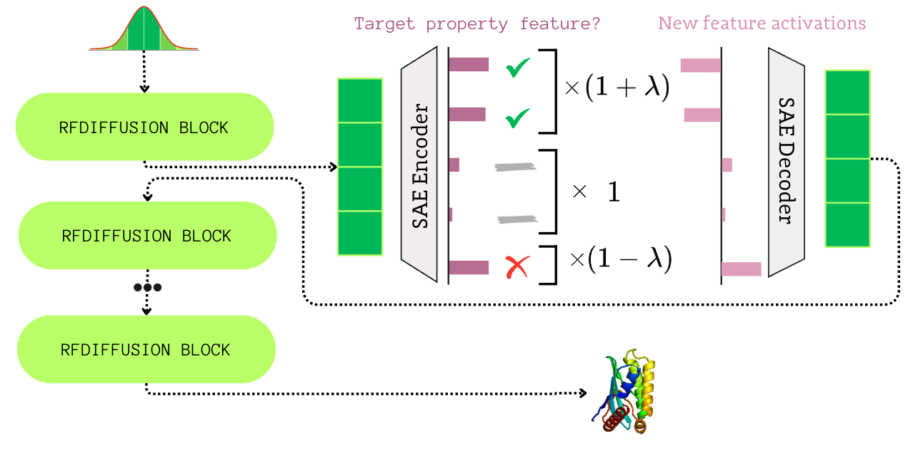
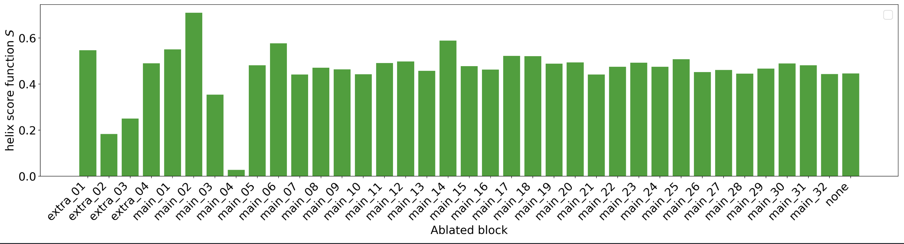
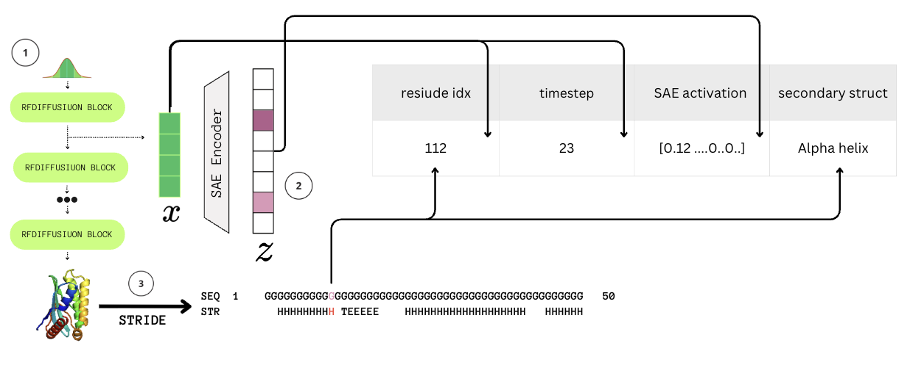
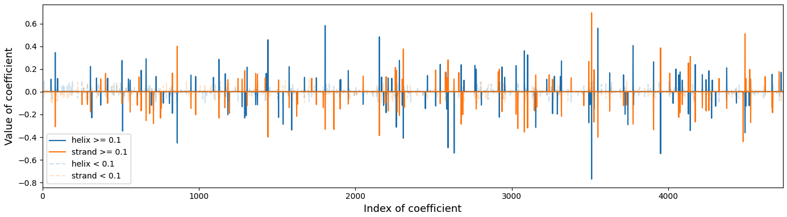
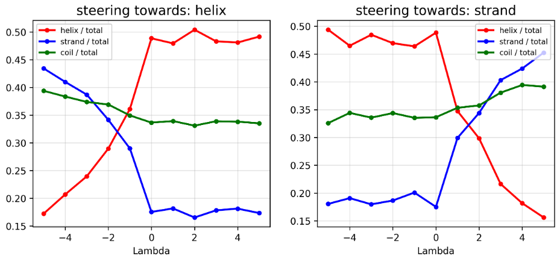
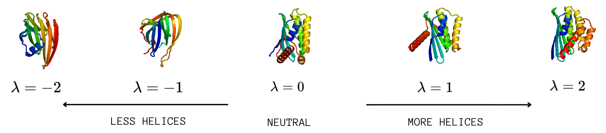

# FoldSAE: Learning to Steer Protein Folding Through Sparse Representations

[](https://arxiv.org/abs/2511.22519)

<!-- <p align="center"><a href="https://arxiv.org/abs/2511.22519" style="font-size:28px; font-weight:700; text-decoration:none;">📄 arXiv:2511.22519 — FoldSAE: Interpretable Control of Protein Structure Generation</a></p> -->

**FoldSAE** applies Sparse Autoencoders (SAEs) to the internal representations of RFdiffusion to uncover secondary structure–specific features and establish precise control over protein backbone generation. This framework pioneers interpretable steering in protein structure design, demonstrating how understanding internal features can be directly translated into control over the protein design process.

## Overview

RFdiffusion is a powerful generative model for protein structures, but its internal representations and decision-making process remain largely opaque. We address this by:
1. **Localizing** which RFdiffusion blocks encode information about protein secondary structures
2. **Interpreting** block activations using Sparse Autoencoders to discover mono-semantic features
3. **Intervening** on these features to enable precise, tunable control over helix and strand formation


*Overview of the FoldSAE steering mechanism: activations are intercepted, decomposed into sparse features, modulated based on their correlation with target properties, and reintroduced to guide protein generation.*

## Method

### 1. Localization: Finding the Right Block

We perform systematic ablation of RFdiffusion blocks to identify which block introduces secondary structure information into the residual stream. For a given block $m$, we substitute its output with the previous block's output and measure the impact on secondary structure distribution.

The optimal block $m^*$ is selected by maximizing the change in property strength:

$$m^* = \text{argmax}_{m} \left| S(M_{\text{orig}}) - S(M_{\setminus m}) \right|$$

where $S$ is a score function measuring the desired property and $M_{\setminus m}$ is the model with block $m$ ablated.


*Localization of secondary structure encoding: ablating block `main_04` renders RFdiffusion incapable of generating helices.*

### 2. Interpretation: Training Sparse Autoencoders

We train a top-K SAE to decompose block activations into interpretable features. The architecture consists of:

- **Encoder**: $\mathbf{z} = \text{TopK}(\text{ReLU}(\mathbf{W}_{\text{enc}}(\mathbf{x} - \mathbf{b})))$
- **Decoder**: $\mathbf{\hat{x}} = \mathbf{W}_{\text{dec}}\mathbf{z} + \mathbf{b}$

where activations of length $l \times d$ (residues × hidden dimension) are treated as $l$ patches of dimension $d$.

**Training configuration:**
- 50,000 steps, batch size 4,096
- Learning rate: $1 \times 10^{-4}$
- Expansion factor: 16, k=64
- **Results**: 99.1% explained variance, minimal dead features


#### Feature Selection via Probing

To identify discriminative features, we:
1. Generate 10,000 proteins with integrated SAE and cache encoder activations
2. Assign secondary structures to residues using Stride
3. Train One-vs-Rest logistic regression classifiers (helix vs. rest, strand vs. rest)
4. Select features where coefficients exceed threshold with opposite signs between classifiers


*Probing dataset collection pipeline.*

**Classifier performance** (time-agnostic):
- Helix: 84.1% balanced accuracy, 94.1% ROC AUC
- Strand: 83.0% balanced accuracy, 93.3% ROC AUC


*Regression coefficients for helix (blue) and strand (orange) classifiers. The largest coefficients coincide at the same feature indices but with opposite signs, suggesting shared latent features govern structural differentiation.*

### 3. Intervention: Steering Generation

We modulate SAE features based on their correlation with target properties using a tunable parameter $\lambda$:
- $\lambda = 0$: No intervention
- $\lambda > 0$: Steer towards target property
- $\lambda < 0$: Steer away from target property

Features are scaled by:
- $(1+\lambda)$ if positively correlated with target
- $(1-\lambda)$ if negatively correlated
- $1$ otherwise

## Results

### Precise Control Over Secondary Structure

Steering intensity $\lambda$ provides fine-grained control over secondary structure distribution:


*Fraction of helices (red), strands (blue), and coils (green) as a function of $\lambda$. Left: steering towards helices. Right: steering towards strands.*

### Single Protein Structure Control

Individual protein backbones demonstrate direct correlation between $\lambda$ and secondary structure density:


*3D structures generated with $\lambda \in \{-2, -1, 0, 1, 2\}$. Negative values suppress helix formation (left), while positive values promote higher helix density (right).*

### Biological Plausibility Maintained

We validate that steered structures remain biologically plausible by:
1. Converting backbones to sequences using ProteinMPNN
2. Embedding sequences with ESM2
3. Comparing distributions using FBD and MMD metrics

**Key finding**: Non-zero $\lambda$ interventions show no significant deviation from baseline ($\lambda=0$), confirming biological validity is preserved during steering.

| Target  | Metric | λ=-5   | λ=-4   | λ=-3   | λ=-2   | λ=-1   | **λ=0** | λ=1    | λ=2    | λ=3    | λ=4    | λ=5    |
|---------|--------|--------|--------|--------|--------|--------|---------|--------|--------|--------|--------|--------|
| helices | FBD    | 92.43  | 92.23  | 92.69  | 91.92  | 92.28  | **92.83** | 92.10  | 92.25  | 92.21  | 91.76  | 88.50  |
|         | MMD    | 703.82 | 702.28 | 709.50 | 701.98 | 706.47 | **704.87** | 694.63 | 704.00 | 699.09 | 701.23 | 648.20 |
| strands | FBD    | 91.95  | 91.82  | 91.79  | 92.54  | 91.74  | **92.83** | 92.50  | 93.26  | 93.08  | 92.23  | 92.66  |
|         | MMD    | 705.63 | 702.86 | 697.06 | 698.99 | 698.87 | **704.87** | 709.27 | 711.09 | 719.05 | 707.67 | 711.83 |

## Setup
```shell
git clone --recursive git@github.com:wz7475/SAEtoRuleRFDiffusion.git
```

enviroment
```shell
# we require installed conda and python 3.10 due to depencies of original RFdiffusion
bash ./scripts/envs/rfdiffsae.sh
```

Weights are available at this [link](https://drive.google.com/file/d/1tryqqxtXT6qlLvMOCKSfnfq_hW3y7vt-/view?usp=sharing).

## usage
- each directory contains subproject
- `scripts` contain script to run functionalities of each subproject - [check out here for more info](scripts/readme.md)

### 1) Block choice
First you need to find block which stores the knowledge about concepts of interest

#### Make ablations
Replace the simple call below with the documented CLI usage for scripts/ablations/ablations.sh - checkout script for docs.

Usage:
```shell
bash scripts/ablations/ablations.sh <start_main> <end_main> <start_extra> <end_extra> [num_designs] [final_step] [output_dir] [PYTHON_EXEC] [reference_dir]
```

to speed up process you may also use `scripts/structures/ablations/tmux_ablations.sh`


#### Eval ablations for concept of your interest
This repository includes an evaluation pipeline (scripts/structures/ablations/eval_pipeline.sh) to analyze ablation outputs and summarize structural changes without prescribing an exact invocation here. Checkout scripts for description of each argument.

Usage:
```shell
bash scripts/structures/ablations/eval_pipeline.sh [--pdb_dir <path>] [--stride_dir <path>] [--plot_dir <path>] [--results_file <file>] [--stride_binary <path>] [--python <path>]
```

### 2) SAE trainig
Train SAE in unsupervised manner on collected activations

#### Collect activations for chosen block
```shell
bash ./scripts/sae/collect_activations.sh [num_designs] [input_dir] [protein_length] [config_name] [final_step] [log_file] [PYTHON_RFDIF] [PYTHON_SAE]
```
put config into `RFDiffSAE/config/activations` it may look like
```yaml
map:
  simulator.main_block.4: block4
#  as many pairs as needed
dataset_path: temp_activations
keep_every_n_timestep: 10
keep_every_n_token: 10
save_activations_after_n_designs: 200
```


#### train SAE
run 
```shell
python universaldiffsae/src/scripts/train.py --dataset_path=/home/wzarzecki/ds_10000x_block_2/activations   --effective_batch_size=4096 --expansion_factor=4 --hookpoints=block4_non_pair --k=32 --lr=0.005 --max_trainer_steps=500 --wandb_project=SAE_main_02
```
for details check `RunConfig` in `universaldiffsae/src/sae/config.py`

to automate running SAE trainig with various hyper-params run grid search, you may use wandb setup
```shell
wandb sweep scripts/sae/sweep_train_sae.yaml
wandb agent <sweep_id>
#or
bash scripts/sae/tmux_wandb_agents.sh <sweep_id_with_prefix> <cuda_idx> <num_of_agents>
```

### 3) find feature indicies by training probes
train probing models and map their coefficients to feature indices -> let's learn which feature are responsible for concepts of interest

#### create auxiliary dataset with latents and associated concepts
for secondary structure you may use this script
```shell
bash scripts/structures/create_ds/probes_ds_from_block_act.sh <input_dir> <block_act_dir> <log> <sae_for_pair> <sae_for_non_pair> <stride_bin> <python_bin>
```

#### train probes on it
for secondary structure you may use
```shell
bash scripts/structures/probes/probes_sweep.sh <dataset_dir> <dir_to_store_coefs> <dir_to_store_results> <python_bin>
```

#### choose number of coeficients via visualisation of discriminative features
run notebook `./notebooks/strucutres/coefs_visualization.ipynb` to analyze how many discriminitive features can be found for given treshold


### 4) causal intervention with SAE
run shell script 
#### run interventions
```shell
bash sweep_structure_interventions.sh [lambda_start] [lambda_stop] [lambda_step] [threshold_start] [threshold_stop] [threshold_step] [first_classes] [input_dir] [num_designs] [seed] [indices_path_pair] [sae_non_pair] [sae_pair] [base_dir_for_config] [python] [prefix] [length] [coef_helix] [coef_beta] [coefs_output_dir]
```

This script performs a grid search over $\lambda$ and threshold parameters to run structure interventions, generating a configurable number of protein designs for specific secondary structure classes. It utilizes pre-trained Sparse Autoencoders (SAEs) and coefficients to guide the RFDiffusion process.


You can split across tmux sessions running
```shell
bash run_sweep_interventions.sh [seed] [lambda_start] [lambda_end] [lambda_step] [threshold_a] [threshold_b] [threshold_c] [num_designs] [classes_string]
```
#### eval interventions
```shell
bash scripts/structures/interventions/eval_pipeline.sh <structures_source_dir_from_sweep> <results_dir>
```
#### validate structures
```shell
bash scripts/structures/validation/val_dir_of_dirs.sh <structures_source_dir_from_sweep/pdb> <val_results_dir> <n_ref>
```
